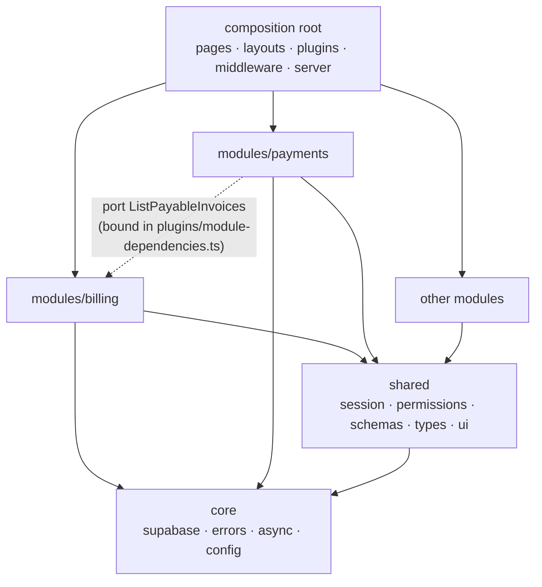

# Architecture Refactor — Design Spec

**Date:** 2026-09-13
**Status:** Proposed. Pilot (billing + payments) implemented, not committed, in worktree `.worktrees/arch-prototype` on branch `refactor/architecture-prototype`.
**Conventions record:** `.claude/skills/project-conventions/SKILL.md` (rules + decision log). This spec explains and plans; it does not restate the rules.

## 1. Summary

The repo already has the right skeleton: feature folders under `src/modules`, a service layer returning `Result<T>`, shared Zod schemas, colocated tests. The boundaries are not real, though:

- Modules reach into each other (21 explicit imports in 19 files, plus hidden ones through Nuxt auto-import).
- Stores know the Supabase client.
- Errors are raw database strings.
- Half the list pages have no error state.
- Nothing enforces the rules.

The plan keeps the stack and the folder vocabulary. It adds:

- boundary aliases and lint enforcement;
- a single error type and a single screen-state model;
- ports injected from one composition-root plugin;
- a shared session kernel.

Modules then migrate one pull request at a time. A billing + payments pilot proves every mechanism; the pilot also surfaced one framework trap (§2.5, D-9).

## 2. Current state

### 2.1 Stack

| Concern | In use |
|---|---|
| Framework | Nuxt 3.21 (SSR, `srcDir: src/`), Vue 3.5, TypeScript strict |
| State | Pinia 3 — Options stores (auth, tenant, kindergartens, attendance, children, groups, staff, pool, dashboard) and Setup stores (billing, payments, expenses) |
| Data | Supabase (`@supabase/ssr`, supabase-js 2.108), RLS, Postgres RPC aggregates |
| UI | Nuxt UI 3.3, Tailwind 4 |
| Validation | Zod 4 in `src/shared/schemas` |
| i18n | @nuxtjs/i18n 10 (RO default, EN) |
| Tests | Vitest 4 (node env, colocated), Playwright (`tests/e2e`), pgTAP via PGlite (`supabase/tests`) |
| Lint | @nuxt/eslint flat config (import-x, unicorn, vue) |

Baseline in the worktree before any change: typecheck ✓ · eslint 0 errors / 19 warnings · Vitest 30 files / 222 tests ✓.

### 2.2 Current tree (directories, file count in parentheses)

```text
.
├── nuxt.config.ts  vitest.config.ts  playwright.config.ts  eslint.config.mjs
├── scripts/ (2)                        # db type sync, pgTAP runner
├── supabase/  migrations/ (39)  tests/ (7)  seed.sql
├── tests/e2e/ (9)
└── src/
    ├── app.vue  app.config.ts  README.md
    ├── assets/css/ (1)
    ├── pages/ (14) children/ (2) groups/ (2) pool/ (2)   # thin route wrappers
    ├── layouts/ (3)                                      # admin.vue = shell + tenant auto-select
    ├── middleware/ (2)                                   # auth.global, role
    ├── plugins/ (2)                                      # auth-state.client
    ├── server/api/ health, staff/invite, gdpr/children/[id]/{export,anonymize}
    ├── core/
    │   ├── auth/ (2)          session-reset
    │   ├── email/ (1)         send.ts (templates/ empty)
    │   ├── i18n/locales/ (2)
    │   ├── middleware/ (6)    auth/role redirect helpers + tests
    │   ├── powersync/ (0)
    │   ├── storage/ (1)       avatar.service
    │   └── supabase/ (2)      client.ts, types.ts (generated)
    ├── shared/
    │   ├── composables/ (2)   useFormModal, useStoreAction
    │   ├── schemas/ (13)
    │   ├── types/ (2)         result.ts, page-meta.d.ts
    │   ├── ui/ (11)           BaseAvatar, BaseFilterTabs, BasePageHeader, BasePagination, BaseStatCard, …
    │   └── utils/ (2)         generatePassword, staffFilters
    └── modules/               # each: components/ composables/ pages/ services/ stores/ types/
        ├── attendance/        auth/          billing/       children/ (+utils)
        ├── dashboard/         expenses/      groups/        kindergartens/ (auth-independent tenant.store here)
        ├── payments/          pool/          settings/      staff/
```

### 2.3 Already aligned with the target

| Principle | Evidence |
|---|---|
| Feature folders with layered subfolders | every `src/modules/<m>/` |
| One DB-calling layer | 14 `*.service.ts`, all returning `Result<T>` |
| Validation at the boundary | Zod schemas reused by services and `server/api/staff/invite.post.ts` |
| Aggregates in Postgres, not over capped lists | `invoice_summary`, `expense_summary` RPCs |
| Colocated unit tests, separate e2e | `x.test.ts` beside `x.ts`; `tests/e2e/` |
| No deep relative imports | 0 `../../`; ~140 `~/` imports |
| Secrets server-only | `runtimeConfig.supabaseServiceRoleKey` |
| Commit subjects | Conventional Commits (`fix(data): …`, `feat(expenses): …`) |
| Authorization authority in the database | RLS + pgTAP isolation tests |

### 2.4 Not aligned

| # | Finding | Evidence |
|---|---|---|
| A1 | Modules import other modules | 21 explicit imports in 19 files. 8 modules import `auth.store` / `moduleAccess.types` (attendance, staff, kindergartens, pool, expenses, payments, billing, staff UI). 4 pages import `kindergartens/stores/tenant.store`. `server/api/staff/invite.post.ts:4-5` deep-imports groups + staff services. `billing.service.test.ts:5` imports payments. |
| A2 | Hidden coupling through auto-import | `nuxt.config.ts` registers every module's `stores/` and `composables/` globally. Examples: `AttendancePage.vue:9-10` uses groups + children stores; `GroupsListPage.vue:17` uses the staff store; `SettingsPage.vue:10` and `PoolTrainerSettingsPage.vue:7` use the auth store — none with an `import`. |
| A3 | No public API per module | no `src/modules/*/index.ts` |
| A4 | Stores know infrastructure | `useSupabaseClient()` in 12 stores; `SettingsPage.vue:3,12` calls a service directly |
| A5 | Two store styles, duplicated loading logic | `useStoreAction` in Options stores; hand-rolled try/finally in billing/payments/expenses |
| A6 | Raw database messages reach the UI; no network vs refusal distinction | services return `error.message`; `Result.error: string` |
| A7 | Missing error states | no error UI in billing, expenses, kindergartens, payments, staff list pages and pool settings; child profile shows "not found" on a fetch failure |
| A8 | No global error handling | no `error.vue`, no `NuxtErrorBoundary`, no `errorHandler` plugin |
| A9 | Stale responses after switching kindergarten | guarded only in `attendance.store.ts` (`loadVersion`) and `auth.store.ts` (`sessionVersion`) |
| A10 | Environment config unvalidated and build-time | `nuxt.config.ts` reads `process.env.SUPABASE_URL ?? ''`; missing values fail at first request; non-`NUXT_` names cannot be overridden at runtime in a built image; Brevo vars in `.env.example` are not wired |
| A11 | Oversized pages mixing concerns | `ChildProfilePage.vue` 521, `ChildrenListPage.vue` 519, `StaffListPage.vue` 478, `SettingsPage.vue` 418, `GroupsListPage.vue` 344 lines |
| A12 | Domain code and stale docs in `shared/` | `shared/utils/staffFilters.ts`; `shared/README.md` lists `BaseButton`, `BaseInput`, `BaseModal`, `BaseBadge`, which do not exist |
| A13 | Cryptic names | `q`, `v`, `r`, `m`, `g` in services/stores (`payments.service.ts`, `staff.store.ts:132`, `childAge.ts:5`) |
| A14 | Commit trailers | recent commits carry `Co-Authored-By` and session trailers; the requested convention forbids them |
| A15 | CLAUDE.md drift | lists 7 V1 modules (12 exist) and marks payments out of scope; module rule "communicate via a module's public store" is what produced A1/A2 |

### 2.5 Defects found during the audit

| # | Defect | Where | Pilot fixes it |
|---|---|---|---|
| D-1 | `<BaseButton>` / `<BaseBadge>` do not exist → rendered as unknown elements; add/confirm buttons do nothing | `PaymentsListPage.vue`, `ExpensesListPage.vue` | payments |
| D-2 | `<UModal v-model>`; Nuxt UI v3 requires `v-model:open` + `#content` | `PaymentsListPage.vue` | yes |
| D-3 | Recording a payment asks the user to type an invoice UUID | `PaymentsListPage.vue:55-56` | yes — select from payable invoices |
| D-4 | Confirm payment / mark invoice paid have no tenant filter and no source-status guard (RLS still limits tenant) | `payments.service.ts`, `billing.service.ts` | yes |
| D-5 | Money and dates hardcoded to `ro-RO` / `RON` regardless of locale; `date` columns parsed as UTC midnight and formatted in local time; default payment date taken from the UTC day | billing, payments pages | locale + calendar dates yes, via `@shared/composables/useLocaleFormat`; currency no (open question) |
| D-6 | Payment stat cards reduce a list capped at 1000 rows | `PaymentsListPage.vue:128-130` | documented; needs an RPC |
| D-7 | One `loading` flag: confirming one payment puts the whole list into loading | `payments.store.ts` | yes — per-row pending |
| D-8 | `fetchByInvoice(kindergartenId, '')` used to mean "all invoices" | `PaymentsListPage.vue:124` | yes |
| D-9 | Nuxt 3 loads `src/modules/*/index.ts` as local **Nuxt** modules; adding a public `index.ts` breaks `nuxi prepare` ("Could not load …/modules/auth/index.ts. Is it installed?") | found by the pilot | yes — `dir: { modules: 'nuxt-modules' }` |

## 3. Target architecture

### 3.1 Target tree

```text
.
├── aliases.config.ts                  # NEW: single alias source (nuxt + vitest)
├── nuxt.config.ts                     # alias, dir.modules override, shrinking auto-import dirs
├── eslint.config.mjs                  # boundary rules + boundaryEnforcedModules
├── tests/
│   ├── e2e/
│   └── support/                       # NEW: reusable fakes (supabase-client-fake.ts)
└── src/
    ├── app.vue
    ├── error.vue                      # NEW: fatal error page
    ├── pages/                         # composition root: route wrappers → @modules/<m>/pages/*Page.vue
    ├── layouts/                       # composition root: shell, NuxtErrorBoundary around the page slot
    ├── middleware/                    # composition root: route guards reading shared/session
    ├── plugins/                       # composition root
    │   ├── module-dependencies.ts     # NEW: builds services, binds ports, provides per module
    │   ├── error-reporting.ts         # NEW: vueApp.config.errorHandler
    │   └── auth-state.client.ts
    ├── server/                        # composition root (server)
    │   ├── api/                       # thin handlers → @modules/<m>/server
    │   ├── plugins/validate-environment.ts   # NEW
    │   └── utils/http-error.ts        # NEW: domain error → HTTP response, server logging
    ├── core/                          # infrastructure, no domain words
    │   ├── async/latest-request.ts    # NEW
    │   ├── auth/session-reset.ts
    │   ├── config/environment.ts      # NEW: Zod-validated runtime config
    │   ├── email/
    │   ├── errors/app-error.ts        # NEW
    │   ├── i18n/locales/
    │   ├── routing/                   # ← core/middleware redirect helpers (pure)
    │   ├── storage/avatar.service.ts
    │   └── supabase/client.ts, types.ts
    ├── shared/                        # used by ≥ 2 modules
    │   ├── composables/               # useAppErrorMessage, useLocaleFormat (NEW), useFormModal
    │   ├── contracts/                 # port types with ≥ 2 consumers; domain-events.ts when needed
    │   ├── permissions/               # ← modules/auth/composables/usePermissions + pure can() policy
    │   ├── schemas/
    │   ├── session/                   # tenant.store.ts (← kindergartens), actor.store.ts (NEW)
    │   ├── types/                     # result.ts (Result<T, E>), screen-status.ts (NEW)
    │   ├── ui/                        # Base* + BaseAsyncState (NEW)
    │   └── utils/                     # generatePassword, locale formatting (staffFilters → modules/staff/utils)
    └── modules/<module>/
        ├── index.ts                   # client public API
        ├── server.ts                  # server public API (groups, staff, children)
        ├── <module>.dependencies.ts   # InjectionKey + inject helper (modules with ports)
        ├── README.md
        ├── pages/  components/  composables/  stores/  services/  types/  utils/
```

### 3.2 Folder roles

| Folder | Role | Must not |
|---|---|---|
| `pages/`, `layouts/`, `middleware/`, `plugins/`, `server/` | Composition root: routing, shell, wiring modules through ports | hold business rules |
| `core/` | Infrastructure: Supabase client, error type, async guards, config, email, i18n files | mention children, invoices, groups |
| `shared/ui` | Presentational `Base*` components | fetch or know a domain |
| `shared/session` | Selected kindergarten, current actor | depend on auth internals |
| `shared/permissions` | `can(action, resource, target)` policy | be bypassed by role checks in components |
| `shared/schemas`, `shared/types`, `shared/contracts` | Contracts reused by ≥ 2 modules | contain behavior |
| `modules/<m>/services` | Only Supabase caller; returns `Result<T, AppError>` | decide UI or read stores |
| `modules/<m>/stores` | Screen/module state, orchestration, stale-response guard | import the Supabase client |
| `modules/<m>/composables` | UI logic (forms, filters) | wrap the store 1:1 |
| `modules/<m>/pages`, `components` | Rendering and events | call services |
| `tests/support` | Fakes shared by many tests | assert anything |

### 3.3 Dependency direction



The dotted arrow is not an import: payments declares the port type, billing satisfies it structurally, and only the plugin knows both.

### 3.4 Cross-cutting patterns

- **Errors.** `AppError = { kind: 'network' } | { kind: 'refused', reason } | { kind: 'validation', issues }`.
  - postgrest-js reports a fetch that never reached the server as `status: 0` (checked in `@supabase/postgrest-js/dist/index.mjs`), which maps to `network`.
  - Codes `42501` / `PGRST116` / `PGRST301` / `23505` map to forbidden / not_found / session_expired / conflict; everything else maps to `rejected`.
  - The UI resolves `errors.*` i18n keys through `useAppErrorMessage`; an unknown reason falls back to `errors.refused.rejected`.
  - Server routes use one `http-error.ts` mapper: 400 validation, 401, 403, 404, 409, 500 generic plus a server log with context.
- **Screen state.** Stores derive `status: loading | ready | empty | failed` and expose `loadError`. Pages render exactly one state. `NuxtErrorBoundary` in the admin layout isolates a crashing page; `error.vue` handles fatal errors.
- **Stale responses.** `createLatestRequestGuard()`; switching kindergarten clears the previous tenant's rows before fetching.
- **Configuration.**
  - `core/config/environment.ts` validates runtime config with Zod.
  - A Nitro plugin validates it at boot and fails fast.
  - `runtimeConfig` keeps empty defaults that `NUXT_*` variables override at runtime.
  - No other file reads `process.env`.
  - Profiles: development / test / production. Staging is added only if a real staging deploy exists.
- **Aliases.** `aliases.config.ts` feeds `nuxt.config.ts` (the generated tsconfig paths were verified) and `vitest.config.ts`.
- **Boundary enforcement.** `no-restricted-imports` regex patterns run per module, plus a `boundaryEnforcedModules` list that grows with each migration step. `shared/` and `core/` may never import a module.
- **Tests.**
  - Services use `createSupabaseClientFake`, which records the builder chain.
  - Stores use real DI: `app.provide(key, fakes)`. It was verified that Pinia 3 setup stores resolve app-level `inject` without a mounted component.
  - Test names describe behavior.
- **Git.**
  - Conventional Commits, with no AI or co-author trailers.
  - Moves and behavior changes go in separate commits.
  - Every commit keeps the lint, typecheck, test and build gates green.

## 4. Module examples

### 4.1 `billing` — independent

**Purpose:** a kindergarten's invoices, the database-side summary, marking an invoice paid, and the list of payable invoices other modules may need.
**Depends on:** `core`, `shared` only.
**README:** `src/modules/billing/README.md`.

```text
modules/billing/
├── index.ts                    # createBillingService, billingDependenciesKey
├── billing.dependencies.ts     # InjectionKey<BillingDependencies> + injectBillingDependencies()
├── README.md
├── pages/BillingListPage.vue
├── services/billing.service.ts (+ .test.ts)
├── stores/billing.store.ts     (+ .test.ts)
└── types/billing.types.ts      # Invoice, InvoiceSummary, PayableInvoice, BillingService, BillingDependencies
```

`src/modules/billing/services/billing.service.ts`

```ts
import type { SupabaseClient } from '@supabase/supabase-js'
import { appErrorFromPostgrest } from '@core/errors/app-error'
import type { Database, Tables } from '@core/supabase/types'
import type { BillingService, Invoice, InvoiceStatus } from '../types/billing.types'

type ChildName = Pick<Tables<'children'>, 'first_name' | 'last_name'>
type InvoiceWithChild = Tables<'invoices'> & { children: ChildName | null }

const invoiceWithChildColumns = '*, children(first_name, last_name)'
const payableInvoiceColumns = 'id, amount, due_date, children(first_name, last_name)'
const payableStatuses: InvoiceStatus[] = ['issued', 'overdue']

function formatChildName(child: ChildName | null): string {
  return child ? `${child.first_name} ${child.last_name}` : ''
}

function toInvoice(row: InvoiceWithChild): Invoice {
  return {
    id: row.id,
    kindergartenId: row.kindergarten_id,
    childId: row.child_id,
    childName: formatChildName(row.children),
    amount: Number(row.amount),
    dueDate: row.due_date,
    paidAt: row.paid_at,
    status: row.status,
    notes: row.notes,
    createdAt: row.created_at,
    updatedAt: row.updated_at,
    createdBy: row.created_by,
    updatedBy: row.updated_by,
  }
}

export function createBillingService(client: SupabaseClient<Database>): BillingService {
  return {
    async listInvoices(kindergartenId) {
      const response = await client
        .from('invoices')
        .select(invoiceWithChildColumns)
        .eq('kindergarten_id', kindergartenId)
        .is('deleted_at', null)
        .order('due_date', { ascending: false })

      if (response.error) return { success: false, error: appErrorFromPostgrest(response) }
      return { success: true, data: response.data.map(toInvoice) }
    },

    async getSummary(kindergartenId) {
      const response = await client
        .rpc('invoice_summary', { p_kindergarten_id: kindergartenId })
        .single()

      if (response.error) return { success: false, error: appErrorFromPostgrest(response) }
      return {
        success: true,
        data: {
          totalIssued: Number(response.data.total_issued),
          totalPaid: Number(response.data.total_paid),
          totalOverdue: Number(response.data.total_overdue),
          pendingCount: Number(response.data.pending_count),
        },
      }
    },

    async listPayableInvoices(kindergartenId) {
      const response = await client
        .from('invoices')
        .select(payableInvoiceColumns)
        .eq('kindergarten_id', kindergartenId)
        .in('status', payableStatuses)
        .is('deleted_at', null)
        .order('due_date', { ascending: true })

      if (response.error) return { success: false, error: appErrorFromPostgrest(response) }
      return {
        success: true,
        data: response.data.map(row => ({
          id: row.id,
          childName: formatChildName(row.children),
          amount: Number(row.amount),
          dueDate: row.due_date,
        })),
      }
    },

    async markInvoicePaid({ invoiceId, kindergartenId, actorId }) {
      const response = await client
        .from('invoices')
        .update({ status: 'paid', paid_at: new Date().toISOString(), updated_by: actorId })
        .eq('id', invoiceId)
        .eq('kindergarten_id', kindergartenId)
        .in('status', payableStatuses)
        .is('deleted_at', null)
        .select(invoiceWithChildColumns)
        .maybeSingle()

      if (response.error) return { success: false, error: appErrorFromPostgrest(response) }
      // No row: someone already settled or cancelled the invoice, or RLS hides it.
      if (!response.data) return { success: false, error: { kind: 'refused', reason: 'invoice_not_payable' } }
      return { success: true, data: toInvoice(response.data) }
    },
  }
}
```

`src/modules/billing/stores/billing.store.ts`

```ts
import { defineStore } from 'pinia'
import { computed, ref } from 'vue'
import { createLatestRequestGuard } from '@core/async/latest-request'
import { sessionExpiredError, type AppError } from '@core/errors/app-error'
import type { Result } from '@shared/types/result'
import type { ScreenStatus } from '@shared/types/screen-status'
import { injectBillingDependencies } from '../billing.dependencies'
import type { Invoice, InvoiceSummary } from '../types/billing.types'

export const useBillingStore = defineStore('billing', () => {
  const { billingService, readCurrentActorId } = injectBillingDependencies()
  const invoiceRequests = createLatestRequestGuard()

  const invoices = ref<Invoice[]>([])
  const summary = ref<InvoiceSummary | null>(null)
  const loadedKindergartenId = ref<string | null>(null)
  const loadPhase = ref<'loading' | 'loaded' | 'failed'>('loading')
  const loadError = ref<AppError | null>(null)
  const settlingInvoiceIds = ref<string[]>([])

  const status = computed<ScreenStatus>(() => {
    if (loadPhase.value !== 'loaded') return loadPhase.value
    return invoices.value.length > 0 ? 'ready' : 'empty'
  })

  function failLoad(error: AppError): false {
    loadError.value = error
    loadPhase.value = 'failed'
    return false
  }

  async function loadInvoices(kindergartenId: string): Promise<boolean> {
    const request = invoiceRequests.begin()
    if (loadedKindergartenId.value !== kindergartenId) {
      invoices.value = []
      summary.value = null
      loadedKindergartenId.value = kindergartenId
    }
    loadPhase.value = 'loading'
    loadError.value = null

    const [invoicesResult, summaryResult] = await Promise.all([
      billingService.listInvoices(kindergartenId),
      billingService.getSummary(kindergartenId),
    ])
    if (!request.isLatest()) return false
    if (!invoicesResult.success) return failLoad(invoicesResult.error)
    if (!summaryResult.success) return failLoad(summaryResult.error)

    invoices.value = invoicesResult.data
    summary.value = summaryResult.data
    loadPhase.value = 'loaded'
    return true
  }

  async function refreshSummary(kindergartenId: string) {
    const summaryResult = await billingService.getSummary(kindergartenId)
    if (loadedKindergartenId.value !== kindergartenId) return
    if (summaryResult.success) {
      summary.value = summaryResult.data
      return
    }
    // The invoice is already paid; a stale summary must not report the payment as failed.
    console.warn('[billing] summary refresh failed after settling an invoice', { kindergartenId, error: summaryResult.error })
  }

  async function markInvoicePaid(invoiceId: string): Promise<Result<Invoice, AppError>> {
    const actorId = readCurrentActorId()
    const kindergartenId = loadedKindergartenId.value
    if (!actorId) return { success: false, error: sessionExpiredError }
    if (!kindergartenId) return { success: false, error: { kind: 'refused', reason: 'not_found' } }

    settlingInvoiceIds.value = [...settlingInvoiceIds.value, invoiceId]
    try {
      const result = await billingService.markInvoicePaid({ invoiceId, kindergartenId, actorId })
      if (result.success && loadedKindergartenId.value === kindergartenId) {
        invoices.value = invoices.value.map(invoice => (invoice.id === invoiceId ? result.data : invoice))
        await refreshSummary(kindergartenId)
      }
      return result
    }
    finally {
      settlingInvoiceIds.value = settlingInvoiceIds.value.filter(id => id !== invoiceId)
    }
  }

  function isSettling(invoiceId: string): boolean {
    return settlingInvoiceIds.value.includes(invoiceId)
  }

  return {
    invoices,
    summary,
    loadedKindergartenId,
    loadPhase,
    loadError,
    settlingInvoiceIds,
    status,
    loadInvoices,
    markInvoicePaid,
    isSettling,
  }
})
```

### 4.2 `payments` — dependent

**Purpose:** record payments against invoices, list them, and confirm pending ones.
**Needs from outside:**

- payable invoices, owned by billing;
- the current actor, owned by auth;
- the selected kindergarten, owned by `shared/session`.

**README:** `src/modules/payments/README.md`.

How the decoupling works:

| Need | Mechanism | Payments imports |
|---|---|---|
| Payable invoices | Port `ListPayableInvoices` declared in `payments.types.ts`; bound to `billingService.listPayableInvoices` in `plugins/module-dependencies.ts` | nothing from billing |
| Current actor | Port `readCurrentActorId` bound to the auth store in the plugin (moves to `shared/session/actor.store` in step 6) | nothing from auth |
| Selected kindergarten | Shared state `@shared/session/tenant.store` | `@shared` only |
| Reaction to a confirmed payment | None today; a domain event is introduced when such a rule exists (D5) | — |

```text
modules/payments/
├── index.ts                    # createPaymentsService, paymentsDependenciesKey
├── payments.dependencies.ts
├── README.md
├── pages/PaymentsListPage.vue
├── services/payments.service.ts (+ .test.ts)
├── stores/payments.store.ts     (+ .test.ts)
└── types/payments.types.ts     # Payment, PayableInvoice, ListPayableInvoices, PaymentsService, PaymentsDependencies
```

`src/modules/payments/services/payments.service.ts`

```ts
import type { SupabaseClient } from '@supabase/supabase-js'
import { appErrorFromPostgrest, appErrorFromValidation } from '@core/errors/app-error'
import type { Database, Tables } from '@core/supabase/types'
import { paymentSchema } from '@shared/schemas/payment.schema'
import type { Payment, PaymentsService } from '../types/payments.types'

function toPayment(row: Tables<'payments'>): Payment {
  return {
    id: row.id,
    kindergartenId: row.kindergarten_id,
    invoiceId: row.invoice_id,
    amount: Number(row.amount),
    paidDate: row.paid_date,
    method: row.method,
    referenceNumber: row.reference_number,
    status: row.status,
    notes: row.notes,
    createdAt: row.created_at,
    updatedAt: row.updated_at,
    createdBy: row.created_by,
    updatedBy: row.updated_by,
  }
}

export function createPaymentsService(client: SupabaseClient<Database>): PaymentsService {
  return {
    async listPayments(kindergartenId) {
      const response = await client
        .from('payments')
        .select('*')
        .eq('kindergarten_id', kindergartenId)
        .is('deleted_at', null)
        .order('paid_date', { ascending: false })

      if (response.error) return { success: false, error: appErrorFromPostgrest(response) }
      return { success: true, data: response.data.map(toPayment) }
    },

    async recordPayment(input, actorId) {
      const parsed = paymentSchema.safeParse(input)
      if (!parsed.success) return { success: false, error: appErrorFromValidation(parsed.error) }
      const payment = parsed.data

      const response = await client
        .from('payments')
        .insert({
          kindergarten_id: payment.kindergartenId,
          invoice_id: payment.invoiceId,
          amount: payment.amount,
          paid_date: payment.paidDate,
          method: payment.method,
          reference_number: payment.referenceNumber ?? null,
          notes: payment.notes ?? null,
          created_by: actorId,
          updated_by: actorId,
        })
        .select()
        .single()

      if (response.error) return { success: false, error: appErrorFromPostgrest(response) }
      return { success: true, data: toPayment(response.data) }
    },

    async confirmPayment({ paymentId, kindergartenId, actorId }) {
      const response = await client
        .from('payments')
        .update({ status: 'confirmed', updated_by: actorId })
        .eq('id', paymentId)
        .eq('kindergarten_id', kindergartenId)
        .eq('status', 'pending')
        .is('deleted_at', null)
        .select()
        .maybeSingle()

      if (response.error) return { success: false, error: appErrorFromPostgrest(response) }
      // No row: the payment was confirmed concurrently, has failed, or RLS hides it.
      if (!response.data) return { success: false, error: { kind: 'refused', reason: 'payment_not_pending' } }
      return { success: true, data: toPayment(response.data) }
    },

    async getTotalPaidForInvoice(invoiceId) {
      const response = await client.rpc('invoice_total_paid', { p_invoice_id: invoiceId })

      if (response.error) return { success: false, error: appErrorFromPostgrest(response) }
      return { success: true, data: Number(response.data) }
    },
  }
}
```

`src/modules/payments/stores/payments.store.ts`

```ts
import { defineStore } from 'pinia'
import { computed, ref } from 'vue'
import { createLatestRequestGuard } from '@core/async/latest-request'
import { sessionExpiredError, type AppError } from '@core/errors/app-error'
import type { PaymentInput } from '@shared/schemas/payment.schema'
import type { Result } from '@shared/types/result'
import type { ScreenStatus } from '@shared/types/screen-status'
import { injectPaymentsDependencies } from '../payments.dependencies'
import type { PayableInvoice, Payment, PaymentStatus } from '../types/payments.types'

export const usePaymentsStore = defineStore('payments', () => {
  const { paymentsService, listPayableInvoices, readCurrentActorId } = injectPaymentsDependencies()
  const paymentRequests = createLatestRequestGuard()

  const payments = ref<Payment[]>([])
  const payableInvoices = ref<PayableInvoice[]>([])
  const payableInvoicesError = ref<AppError | null>(null)
  const loadedKindergartenId = ref<string | null>(null)
  const loadPhase = ref<'loading' | 'loaded' | 'failed'>('loading')
  const loadError = ref<AppError | null>(null)
  const confirmingPaymentIds = ref<string[]>([])
  const isRecordingPayment = ref(false)

  const status = computed<ScreenStatus>(() => {
    if (loadPhase.value !== 'loaded') return loadPhase.value
    return payments.value.length > 0 ? 'ready' : 'empty'
  })

  const paymentCountByStatus = computed(() => {
    const counts: Record<PaymentStatus, number> = { pending: 0, confirmed: 0, failed: 0 }
    for (const payment of payments.value) counts[payment.status] += 1
    return counts
  })

  // Summed in cents so repeated two-decimal amounts do not drift.
  const confirmedTotal = computed(() => payments.value
    .filter(payment => payment.status === 'confirmed')
    .reduce((totalCents, payment) => totalCents + Math.round(payment.amount * 100), 0) / 100)

  async function loadPayments(kindergartenId: string): Promise<boolean> {
    const request = paymentRequests.begin()
    if (loadedKindergartenId.value !== kindergartenId) {
      payments.value = []
      payableInvoices.value = []
      loadedKindergartenId.value = kindergartenId
    }
    loadPhase.value = 'loading'
    loadError.value = null
    payableInvoicesError.value = null

    const [paymentsResult, payableInvoicesResult] = await Promise.all([
      paymentsService.listPayments(kindergartenId),
      listPayableInvoices(kindergartenId),
    ])
    if (!request.isLatest()) return false

    // Recording a payment needs the invoice list; reading the ledger does not.
    if (payableInvoicesResult.success) payableInvoices.value = payableInvoicesResult.data
    else payableInvoicesError.value = payableInvoicesResult.error

    if (!paymentsResult.success) {
      loadError.value = paymentsResult.error
      loadPhase.value = 'failed'
      return false
    }
    payments.value = paymentsResult.data
    loadPhase.value = 'loaded'
    return true
  }

  async function recordPayment(input: PaymentInput): Promise<Result<Payment, AppError>> {
    const actorId = readCurrentActorId()
    if (!actorId) return { success: false, error: sessionExpiredError }

    isRecordingPayment.value = true
    try {
      const result = await paymentsService.recordPayment(input, actorId)
      if (result.success && loadedKindergartenId.value === result.data.kindergartenId) {
        payments.value = [result.data, ...payments.value]
      }
      return result
    }
    finally {
      isRecordingPayment.value = false
    }
  }

  async function confirmPayment(paymentId: string): Promise<Result<Payment, AppError>> {
    const actorId = readCurrentActorId()
    const kindergartenId = loadedKindergartenId.value
    if (!actorId) return { success: false, error: sessionExpiredError }
    if (!kindergartenId) return { success: false, error: { kind: 'refused', reason: 'not_found' } }

    confirmingPaymentIds.value = [...confirmingPaymentIds.value, paymentId]
    try {
      const result = await paymentsService.confirmPayment({ paymentId, kindergartenId, actorId })
      if (result.success && loadedKindergartenId.value === kindergartenId) {
        payments.value = payments.value.map(payment => (payment.id === paymentId ? result.data : payment))
      }
      return result
    }
    finally {
      confirmingPaymentIds.value = confirmingPaymentIds.value.filter(id => id !== paymentId)
    }
  }

  function isConfirming(paymentId: string): boolean {
    return confirmingPaymentIds.value.includes(paymentId)
  }

  return {
    payments,
    payableInvoices,
    payableInvoicesError,
    loadedKindergartenId,
    loadPhase,
    loadError,
    confirmingPaymentIds,
    isRecordingPayment,
    status,
    paymentCountByStatus,
    confirmedTotal,
    loadPayments,
    recordPayment,
    confirmPayment,
    isConfirming,
  }
})
```

### 4.3 Composition root binding

`src/plugins/module-dependencies.ts`

```ts
import { useSupabaseClient } from '@core/supabase/client'
import { useAuthStore } from '@modules/auth'
import { billingDependenciesKey, createBillingService } from '@modules/billing'
import { createPaymentsService, paymentsDependenciesKey } from '@modules/payments'

// Composition root: the only place that knows which module implements another
// module's port. Runs per request on the server, so no client is shared across users.
export default defineNuxtPlugin({
  name: 'module-dependencies',
  setup(nuxtApp) {
    const client = useSupabaseClient()
    const authStore = useAuthStore()
    const readCurrentActorId = () => authStore.user?.id ?? null
    const billingService = createBillingService(client)

    nuxtApp.vueApp.provide(billingDependenciesKey, { billingService, readCurrentActorId })
    nuxtApp.vueApp.provide(paymentsDependenciesKey, {
      paymentsService: createPaymentsService(client),
      listPayableInvoices: kindergartenId => billingService.listPayableInvoices(kindergartenId),
      readCurrentActorId,
    })
  },
})
```

## 5. What stays unchanged

- The stack: Nuxt 3, Supabase with RLS, Pinia, Nuxt UI, Zod, i18n, Vitest, Playwright. No TanStack Query.
- The folder name `src/modules` and its layer names (`components`, `composables`, `stores`, `services`, `types`, `pages`), plus the `*.store.ts` / `*.service.ts` naming.
- Data flow Component → (Composable) → Store → Service, with `useLazyAsyncData` in pages.
- `Result<T>`, which is extended to `Result<T, E = string>`, so no existing call site breaks.
- Zod schemas in `shared/schemas`, i18n files, route wrappers in `src/pages`.
- Supabase migrations, RLS policies, pgTAP tests, the e2e location, and wire contracts (tables, RPCs, HTTP routes).

## 6. Migration plan

Each step is one pull request unless noted otherwise, leaves the app shippable, and passes `lint`, `typecheck`, `test`, `test:db` and `build` before the next step starts. File moves and behavior changes go in separate commits.

| # | Step | Moves / changes | Risk | Verification |
|---|---|---|---|---|
| 0 | Freeze in-progress work | Commit the 31 modified + untracked files currently on `main`, as their own commits | Refactor diff mixed with feature work | Gates green on `main` |
| 1 | Tooling | Add `aliases.config.ts`, `alias` + `dir: { modules: 'nuxt-modules' }` in nuxt.config, vitest aliases, boundary ESLint rules (`boundaryEnforcedModules = []`, shared/core rule on). No file moves | Low. No npm scopes `@core`/`@shared`/`@modules` exist (checked) | `nuxi prepare` → paths present in `.nuxt/tsconfig.json`; probe imports rejected |
| 2 | Core primitives | Add `core/errors/app-error.ts`, `core/async/latest-request.ts`, `Result<T, E>`, `ScreenStatus`, `useAppErrorMessage`, `useLocaleFormat`, `common.retry`/`common.actions` keys, `errors.*` i18n keys (RO + EN), `tests/support/supabase-client-fake.ts`. Additive only | Low | Unit tests for mapper and guard |
| 3 | Session kernel, part 1 | `modules/kindergartens/stores/tenant.store.ts` → `shared/session/`; store id `tenant` unchanged; add `shared/session` to `imports.dirs` | Low–medium: auto-import resolution, SSR payload key | `tenant.store` + `session-reset` tests; e2e switch kindergarten |
| 4 | Pilot: billing + payments | Service factories, injected dependencies, store status + stale guard, `index.ts`, `*.dependencies.ts`, READMEs, `plugins/module-dependencies.ts`, `modules/auth/index.ts`; remove both modules from auto-import dirs; add both to `boundaryEnforcedModules`. Commits: (a) refactor service/store, (b) pages (D-1, D-2, D-3, D-5, D-7, D-8), (c) status guards (D-4) | Medium: plugin order on SSR, hydration of store refs | Unit + lint + typecheck + build; manual SSR load of `/billing`, `/payments`; kindergarten switch during load; e2e |
| 5 | Global error handling | `src/error.vue`, `NuxtErrorBoundary` around the admin layout page slot, `plugins/error-reporting.ts` | Low | Throw in a page in dev: shell stays, boundary renders |
| 6 | Session kernel, part 2 | `shared/session/actor.store.ts` (id, role, module grants) written by the auth store; `usePermissions` → `shared/permissions` with a pure `can()` policy; `readCurrentActorId` binds to the actor store; remove `useAuthStore` from the 8 modules | **High**: auth flow, session reset (`auth` store excluded by id), UI gating | `usePermissions` tests moved with unchanged expectations; auth/session-reset/auth-state tests; e2e auth + admin; RLS tests untouched |
| 7 | Remaining modules, one PR each | In ascending coupling: expenses (also D-1) → kindergartens → dashboard → pool → groups → children + guardians → staff (`staffFilters` → `modules/staff/utils`) → attendance (ports for group roster and children by group) → settings (split page, stop calling services) → auth. After the third module, extract a shared load-state helper and delete `useStoreAction` | Medium each; attendance and settings highest | Per module: tests, enforced lint, e2e for its routes |
| 8 | Server boundary | `modules/{groups,staff,children}/server.ts`; `server/utils/http-error.ts`; `invite.post.ts` and GDPR routes import server entries; structured server logging replaces `console.error` | Medium: invite security path | `invite.post.test.ts`, `health.get.test.ts`, e2e staff-critical |
| 9 | Environment | `core/config/environment.ts` (Zod), `server/plugins/validate-environment.ts`; stop reading `process.env` in nuxt.config; env names → `NUXT_SUPABASE_SERVICE_ROLE_KEY`, `NUXT_PUBLIC_SUPABASE_URL`, `NUXT_PUBLIC_SUPABASE_ANON_KEY`; wire or drop Brevo vars in `.env.example` | **High (deployment)**: CI, Docker and Vercel env must be renamed in the same release | Boot with a missing var fails fast; preview deploy; CI |
| 10 | Split oversized pages | The 5 pages from A11 → components + form composables (moves first, behavior untouched) | Low–medium | e2e children, staff, groups |
| 11 | Close-out | Remove every module from `components.dirs`/`imports.dirs`; forbid `~/modules` everywhere; update CLAUDE.md (A15), `src/README.md`, `modules/README.md`, `shared/README.md` (A12); mark all rows migrated in project-conventions | Low | Full gates |

Order rationale:

- Steps 1–3 are additive and unblock everything else.
- The pilot takes the smallest pair that has a real dependency, so every mechanism is proven before it spreads.
- Error handling is user-visible and cheap, so it comes early.
- The actor/permissions move lands before the remaining modules because 8 of them import the auth store.
- The environment rename waits until release coordination is possible.

## 7. Pilot verification

Run in `.worktrees/arch-prototype` (a worktree of `main` at `aff008f`, plus a copy of the uncommitted work on `main`):

| Check | Result |
|---|---|
| Baseline before changes | typecheck ✓ · eslint 0 errors / 19 warnings · Vitest 30 files / 222 tests ✓ |
| Pinia setup store `inject()` of app-level provide, no mounted component | ✓ (probe test, then deleted) |
| postgrest-js network failure shape | `status: 0`, `code: ''` (read from `@supabase/postgrest-js/dist/index.mjs`) |
| `nuxi prepare` with module `index.ts` | ✗ before D-9 fix → ✓ after `dir: { modules: 'nuxt-modules' }` |
| Alias paths in generated `.nuxt/tsconfig.json` | `@core`, `@shared`, `@modules`, `@test-support` present |
| Boundary lint probes (module → other module index, deep import, `~/modules`, shared → module) | 5/5 rejected; `plugins/module-dependencies.ts` accepted; unmigrated module deep-importing a legacy module still allowed |
| ESLint on core, shared, plugin, services, stores | 0 problems |
| ESLint full project | 0 errors / 11 warnings (baseline 0 / 19). The boundary rule caught `src/pages/{billing,payments}.vue` still importing `~/modules/...`; fixed to `@modules/<name>/pages/*Page.vue` |
| Vitest full suite | 34 files / 260 tests ✓ (baseline 30 / 222) |
| `nuxi typecheck` | 0 errors |
| `npm run build` (includes type checking) | ✓ |
| SSR smoke of `/billing` and `/payments` with a logged-in admin; e2e | **not run** — needs a real `.env` and credentials; part of step 4's verification |

## 8. Open questions

1. **Scope.** CLAUDE.md marks payments out of scope for V1, yet billing, payments and expenses exist. Should they be confirmed as V1 and the doc updated?
2. **Currency.** Kindergartens operate in Romania and Moldova. Should currency live on the kindergarten record (RON/MDL)?
3. **Invoice settlement.** Should confirmed payments covering an invoice's amount mark it paid automatically? If yes, that is the first domain event (`payments.confirmed`), and the rule belongs in a database trigger so it is also atomic.
4. **Release window** for step 9 (environment variable rename).
